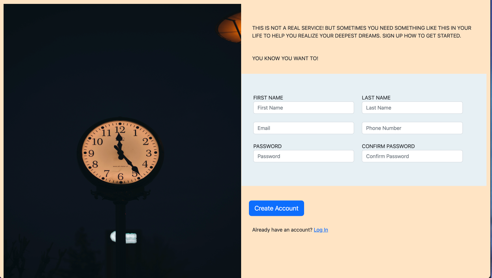

<<<<<<< HEAD
   ## TOP: Sign-Up Form

  

<h2 align="center">
<a href="https://mmackz.github.io/signup-form/">DEMO</a>
</h2>

### About the project

Sign-Up Form is the first project for the FullStack JavaScript module on The Odin Project. 
This mock sign-up form is a mobile-friendly modern layout built using CSS flexbox. Form validation is done using Vanilla JavaScript,
each input will show a different color depending on its state, and briefly display a relevant error message.

### Resources used
  - [Bootstrap](https://getbootstrap.com/) (Build fast and responsive sites)
 
 

### Built With

* HTML
* CSS (Flexbox)
* JavaScript

=======
# signup-form
sign up form built with html, and bootstrap with form validation 

Live site - https://kale-dev1.github.io/signup-form/
>>>>>>> 881cc4db1196faa391efa1743c655c9b0126a72c
